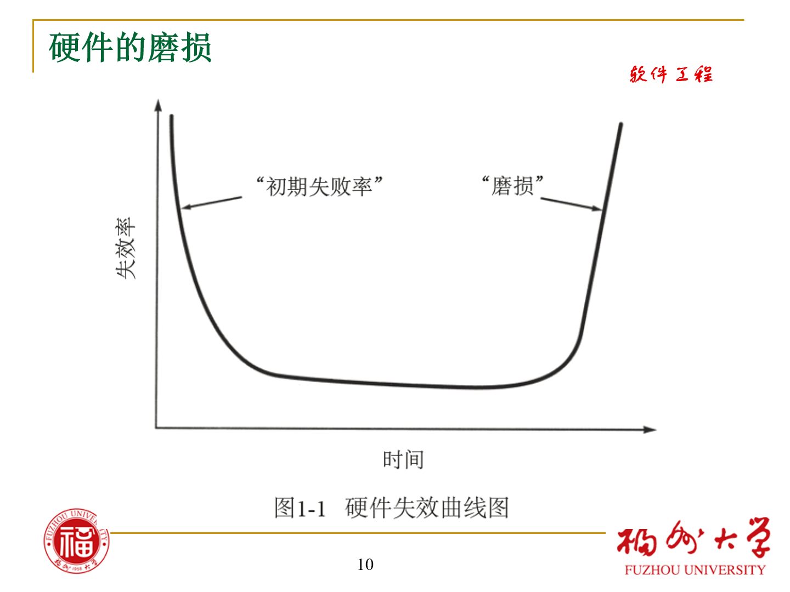
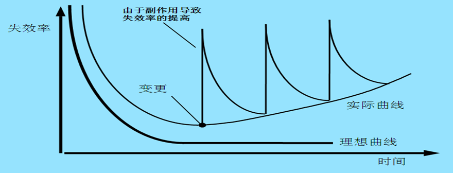
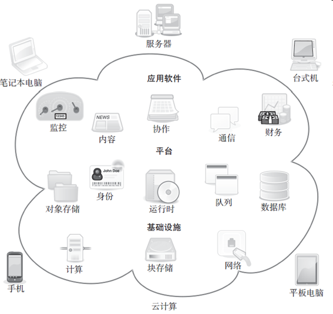
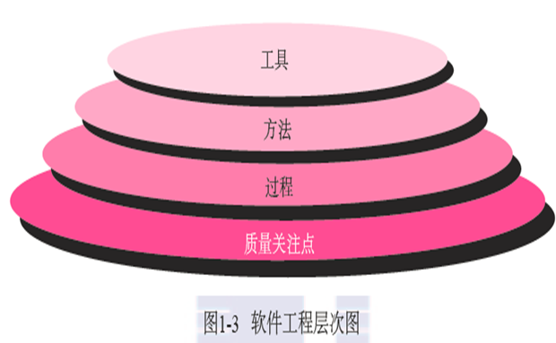
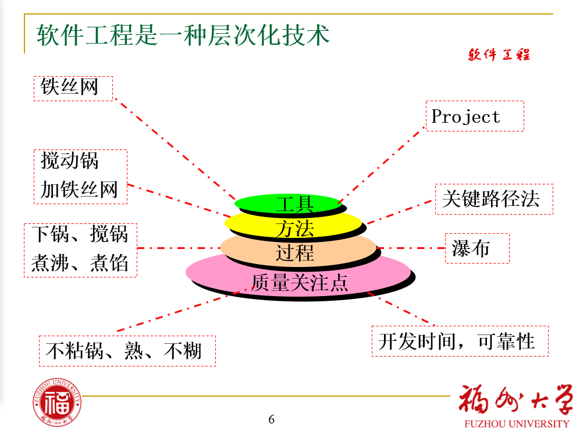
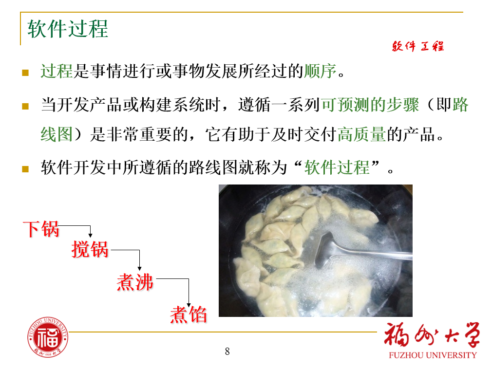
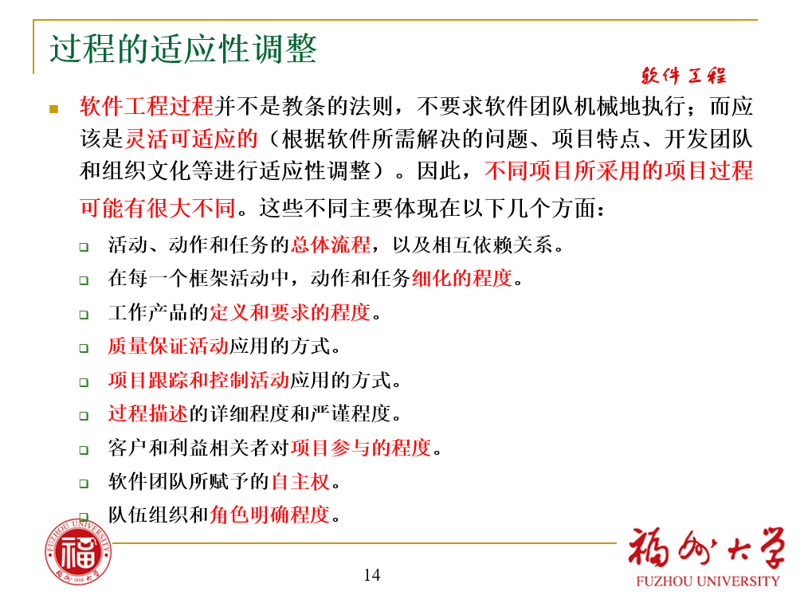

# EE308FZ 笔记B

课程：软件工程

## 第一章 软件的本质

**软件的双重角色**：

- 软件是一种**产品**
  - 扮演者**信息转换**的角色
  - 产生、管理、查询、修改、显示、传递信息
- 软件是**生产产品的载体**，提供以下基础平台
  - 计算机控制（例如，操作系统）
  - 信息通信（例如，网络软件）
  - 应用软件开发（例如，软件工具）

### 1.1 软件的本质

关于什么是软件。

#### 1.1.1 定义软件

**软件是一组要素的集合，包括**：

- 程序
- 文档
- 数据（数据结构）

程序的正常运行离不开必要的文档和数据：

- **文档**是开发、使用和维护程序所需要地点**图文资料**
- **数据**是使程序能够适当地处理信息的数据结构（包括数据库、配置文件等）

---

下文在与硬件的比较中定义软件，凸显其与传统事物之间的差异。

---

**定义软件（特性1）**：

软件和硬件具有完全不同的**特性**：

1. 软件是**设计开发**的，而**不是传统意义上生产制造的**
   1. 硬件和软件可通过优秀的设计获得高品质的产品，然而硬件在制造阶段可能会引入质量问题，这在软件中并不存在（或者易于纠正）。
   2. 软件的**成本主要在于开发设计**，硬件的成本在批量生产时仍然很高。

**关于磨损**

硬件的磨损：

这个被称为“**浴缸曲线**”的是硬件的*失效率时间函数*。

- 硬件在早期具有相对较高的失效率（这种失效通常来自设计或生产缺陷）；
- 缺陷被逐个纠正之后，失效率随之降低并在一段时间内保持平稳（理想情况下很低）；
- 随着时间推移，因为灰尘、震动、不当使用、温度超限以及其他环境问题所造成的硬件组件损耗累积的效果，使得失效率再次提高。简而言之，硬件开始“磨损”了。 

软件的磨损：

在完整的生存周期里，软件的每次**变更**一方面可能解决了一些问题，但同时**可能引入新的错误**，变更还会**导致软件可维护性的下降**，所以失效率在使用一定时间后，会**上升**。

**★** **<mark>软件工程方法的目的即在于使实际曲线能与理想曲线接近。</mark>**

**定义软件（特性2、特性3）**：

2. **软件不会“磨损” **：
   1. 磨损的硬件部件可以用备用部件替换，而软件却不存在备用部件。
   2. 每个软件的缺陷都暗示了设计的缺陷或者在从设计转化到机器可执行代码（实现）的过程中产生的错误。
   3. **软件维护要<mark>应对变更请求</mark>，比硬件维护更为复杂。
      不断的变更是软件退化的<mark>根本原因</mark>。**
3. **基于构件**的构造模式：
   1. **工程学科的发展将产生一系列标准的设计器件**。可复用构件的使用可以使得工程师专心于设计中真正创新的部分。
   2. 在硬件设计中，**构件复用**是工程进程中通用的方法 (例如，标准螺丝钉、可订购的集成电路)。 
   3. 现代**可复用软件构件**封装了数据和对数据的处理。例如，图形窗口、下拉菜单和各种交互机制。

#### 1.1.2 软件应用领域

列表：

1. 系统软件
2. 应用软件
3. 工程/科学软件
4. 嵌入式软件
5. 产品线软件
6. Web应用软件
7. 人工智能软件
8. 开放计算

（开源软件）

内容：

1. **系统软件**：
   1. **系统软件**是**一整套服务于其他程序的程序**：
      1. 某些系统软件（例如：编译器、编辑器、文件管理软件）处理**复杂但确定的信息结构**。
      2. 另一些系统应用程序（例如：操作系统构件、驱动程序、网络软件、远程通信处理器）主要处理的是**不确定的数据**。
   2. **系统软件**多具有以下**特点**：
      1. 和计算机**硬件**大量交互；
      2. 多用户大量使用；
      3. 需要调度、资源共享和复杂进程管理的同步操作；
      4. 复杂的数据结构以及多种外部接口。 
2. **应用软件**：
   1. **解决特定业务需要的独立应用程序**。
   2. 除了传统数据处理的应用程序，应用软件也被用于业务功能的实时控制，例如：
      1. 销售点的交易处理
      2. 实时制造过程控制
3. **工程／科学软件**：
   1. **这类软件通常带着“数值计算”算法的特征**，工程和科学软件涵盖了广泛的应用领域，从天文学到火山学，从自动应力分析到航天飞机轨道动力学，从分子生物学到自动制造业。
4. **嵌入式软件**：
   1. 嵌入式软件**存在于某个产品或者系统中**。
   2. 嵌入式软件可以执行有限但难于实现的功能，例如：
      1. 微波炉的按键控制
   3. 提供重要的功能和控制能力，例如：
      1. 汽车中的燃油控制
      2. 仪表板显示
      3. 刹车系统等汽车电子功能 
5. **产品线软件**：
   1. 产品为多个不同用户的使用**提供特定功能**。
   2. 产品线软件**关注有限的特定的专业市场**，例如
      1. 库存控制产品
   3. 大众消费品市场，例如
      1. 文字处理
      2. 电子制表软件
      3. 电脑绘图
      4. 多媒体
      5. 娱乐
      6. 数据库管理
      7. 个人及公司财务应用
6. **Web应用软件**：
   1. 叫做“Web应用”（WebApp），是一类**以网络为中心**的软件，其概念涵盖了宽泛的应用程序产品。最简单可以是一组超文本链接文件，仅仅用文本和有限的图形表达信息。
   2. 随着Web 2.0的出现，网络应用正在发展为复杂的计算环境：
      1. 比如，网游、网络社区应用
7. **人工智能软件**：
   1. 人工智能软件利用**非数值算法**解决计算和直接分析无法解决的**复杂问题**。
   2. 这个领域的应用程序包括：
      1. 机器人
      2. 专家系统
      3. 模式识别（图像和语音）
      4. 人工神经网络
      5. 定理证明和博弈等。
8. **开放计算**：无线网络的快速发展会促成普适计算、分布式计算、以及云计算的发展。软件工程师面临的挑战是开发系统和应用软件，使得移动设备、个人电脑和企业应用可以通过网络设施进行通信。
9. **开源软件**：代码开放将成为一种趋势。

#### 1.1.3 遗留软件

- 开发年代久远。
- 一直在使用。
- 在使用过程中被不断地修改以满足商业需要和计算平台的变化。
- 可能**仍然支持着核心业务**。
- 质量差：
  - 设计难以扩展
  - 代码令人费解
  - 文档混乱，可能缺失
  - 变更管理混乱
  - 测试记录未归档
- 由于遗留软件常常支撑着核心业务，对其变更必须非常谨慎。如果它能够满足用户的需求并可靠运行，则不要修改它。

**演化**遗留软件的目的：

1. 进行**适应性变化**，以满足新的**计算环境或者技术的需要**
2. 根据**新的业务需求**进行升级
3. **扩展**以及具有与更多现代系统或数据库的协作能力
4. 改建以**适应多样化的网络环境**

### 1.2 软件的变更本质

#### 四类新的软件

列表：

1. WebApp
2. 移动App
3. 云计算
4. 产品线软件

内容：

1. WebApp
   1. 在本书中，WebApp 这个术语包含了很多事物，从一个简单的帮助消费者计算汽车租借费用的网页，到为商务旅行和度假提供全套旅游服务的大型复杂的Web 站点。

2. 移动App
   1. iOS，Android等，移动WebApp与移动App之间有微妙差异。WebApp允许移动设备通过针对移动平台的优点和弱点专门设计的浏览器获取基于Web内容的访问。移动App可以直接访问设备的硬件特性（例如加速器或者GPS定位），然后提供前面所述的本地处理和存储能力。
3. 云计算
     1. 
4. 产品线软件
     1. 软件产品线都**使用相同的底层应用软件和数据体系结构**来开发，并使用可在整个产品线中进行复用的一组软件构件来实现。

## 第二章 软件工程

### 2.1 定义软件工程学科

各种形式、各个应用领域的软件都需要**工程化**。这也是本书的主题—软件工程。 

**定义**：

- Fritz Bauer [Nau69]
  - 建立和使用一套合理的**工程**原则，从而**经济地**获得**可靠的**、可在实际机器上**高效运行的**软件。
- IEEE [IEEE93a]
  - 将**系统化的、规范化的、可量化的**方法应用于软件的开发、运行和维护，**即**将**工程化的**方法应用于软件；
    以上所述方法的研究。

### 2.2 软件过程

#### 软件过程的定义

- 软件工程**工具 (tool)**为过程和方法**提供自动化或半自动化的支持**
- 软件工程**方法（method）**为构建软件**提供技术上的解决方法**（“如何做”）。包括沟通、需求分析、设计建模、编程、测试和技术支持。
- **过程**定义了**一个框架，给出了开发步骤**。

从上到下逐级靠近实际软件，图示关系距离。

#### 软件工程过程框架

- 框架：事物的基本组织、结构 
- **过程框架**：
  - 定义了若干小的**框架活动**，为完整的软件开发过程建立了基础
    - 煮饺过程的框架活动包括：下锅、搅锅、煮沸、煮馅；
  - 每一个**活动**由一组**软件工程动作**组成：
    - “煮馅”活动包括三组“冷水止沸”动作；
  - 每一个**动作**都包括**一系列相互关联的可考核的任务**。
    - 每一个任务完成一个动作定义的一部分工作。
    - “冷水止沸”包括“加冷水”，“煮沸”两个相关联的任务；

---

即：

框架 --> 若干活动，活动 --> 若干动作，动作 --> 若干任务

---

- **通用过程框架**—适用于绝大多数软件项目，包含五个最基本的框架活动：**沟通、策划、建模、构建、部署**：
  - **沟通**。在**技术工作开始之前**，和客户（及其他利益相关者）的沟通与协作是极其重要的；其目的是理解利益相关者的项目目标，并**收集需求**以定义软件特性和功能。 
  - **策划**。也可以称为**软件项目计划**，它定义和描述了软件工程工作，包括需要执行的技术任务、可能的风险、资源需求、工作产品和工作进度计划。 
  - **建模**。**利用模型来更好地理解软件需求**，并**完成**符合这些需求的**软件设计**。
  - **构建**。它包括编码（手写的或者自动生成的）和测试以发现编码中的错误。
  - **部署**。软件（全部或者部分增量）**交付**到用户，用户对其进行评测并给出反馈意见。

---

策划：有哪些要做，风险如何，需要什么、工作工具和进度计划。

---

- **软件工程过程框架活动**由很多**普适性活动**来**补充实现**。通常，这些普适性活动贯穿软件项目始终，以帮助软件团队管理和控制项目进度、质量、变更和风险。典型的普适性活动包括： 
  - **软件项目跟踪和控制**—项目组根据计划评估项目进度，并且采取必要的措施保证项目按进度计划进行。
  - **风险管理**—对可能影响项目成果或者产品质量的风险进行评估。
  - **软件质量**保证—确定和执行软件质量保证的活动。
  - **技术评审**—评估软件工程产品，尽量在错误传播到下一个活动之前，发现并清除错误。
  - **测量**—定义和收集过程、项目和产品的度量，以帮助团队在发布软件的时候满足利益相关者要求。
  - **软件配置管理**—在整个软件过程中，管理变更所带来的影响。
  - **可复用管理**—定义产品复用的标准（包括软件构件），并且建立构件复用机制。
  - **工作产品的准备和生产**—诸如建模、文档、日志、表格和列表等。

### 2.3 软件工程实践

软件工程实践的**精髓**：
1. 理解问题（沟通和分析）
2. 计划解决方案（建模和软件设计）
3. 实施计划（代码生成）
4. 检查结果的正确性（测试和质量保证）

内容：

1. 理解问题，思考以下：
   1. 谁会获益？
   2. 什么东西未知？
   3. 可以继续划分问题为更小、更易理解的问题吗？
   4. 能用图形描述吗？能建立分析模型吗？
2. 

### 2.4 软件开发神话

### 2.5 这一切是如何开始的

